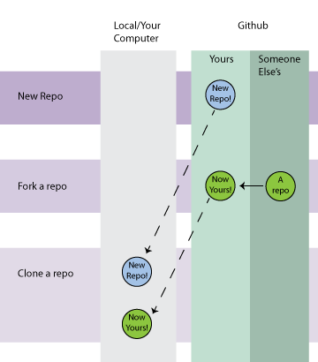

#1.1 Think About Time Reflection

I took a look at the Pomodoro Technique, Fogg Method, counter-intuitive productivity, Flow, Timebox, and tricks for getting in the zone.

Time boxing is a predetermined set of a time that someone works on a project, as opposed to just working until the goal has been completed.  Pomodoro is a method in which to do that.  I can use this is phase 0, along side the useful time length approximations given with each activity.  It would be interested to see if I can associate a certain number of pomodoros on average with the given length approximations in order to get a good idea of how much time I will need.

Currently, I manage my time in the unbox method – just keep working until I feel like I need a break.  I will sometimes write a list of what I need to get done and approximate how many hours I think it will take to get done, but there are definitely issues with this method.  First of all, writing down "4 hours" to get something done makes a task look daunting, and because I don't factor breaks in, I will just put stuff off until that allotted time is nearly up.  Also, I don't break things down into smaller tasks, which makes getting started pretty hard and scary sometimes.  The good thing though is that when I am working on something that I like, I do get into a good state of flow (this tends to happen when I am coding :D )

I plan on using the Pomodoro technique, as well as just breaking tasks down and starting small.  I also really really liked the counter intuitive productivity techniques, especially for dealing with things that I don't want to do/keep putting off.  I also like task switching – unless I'm in a really deep state of flow, then I get bored working on the same thing.  As such, my overall master plan for Phase 0 is to set aside a time of the day to work on DBC stuff, and pomodoro it out.  But I also like listening to when I feel ready to do something, so if I am inspired to do DBC material or other things, I won't hold myself back.  The only downside of pomodoro is that if I am in a state of flow, I really don't want to tear myself away from the task, so I have to consider how I want to deal with that type of situation.  

#1.2 The Command Line Reflection

1. A shell is a simple command line based interface, used to interact directly with the guts of an operating system.  It is great because it allows for easy manipulation of the OS as well as working quickly on a large scale.  

Bash is specifically a Unix shell.

2.  Honestly, the most difficult part of this material was just sitting through an hour long video.  The bookwork session was much better, because command line is best learned interactively because there are lots of small rules and commands to memorize.  But originally, I found command line hard to wrap my head around due to the non-visual feedback of the environment, unlike a GUI environment.  

3.  Yep!

4.  I think man, info, and help are the most important, as it gives you the instructions and the options to use with a command

-pwd print working directory.  Prints the full name of the current working directory
-ls list all files in current working directory
-mv renames files
-cd change directory
-../ to go up multiple directories
-touch creating an empty file
-mkdir make a new directory/folder
-less show the next page's worth of information
-rmdir remove an empty directory
-rm remove files
-help show help for current command (in windows it will bring up man pages)

#1.4 Forking and Cloning Reflection  

I think that instructions given are fairly clear as is.  For clarity purposes, the only thing I might do is add a diagram showing what each one does. 

I didn't have too many troubles, as I have done this before (yay!).  But I did gain a better understanding of branching and merging and what the head file was, master, etc.  This resource, which was listed on one of the Skillcrush blog posts, was awesome.  [http://pcottle.github.io/learnGitBranching/](http://pcottle.github.io/learnGitBranching/)
