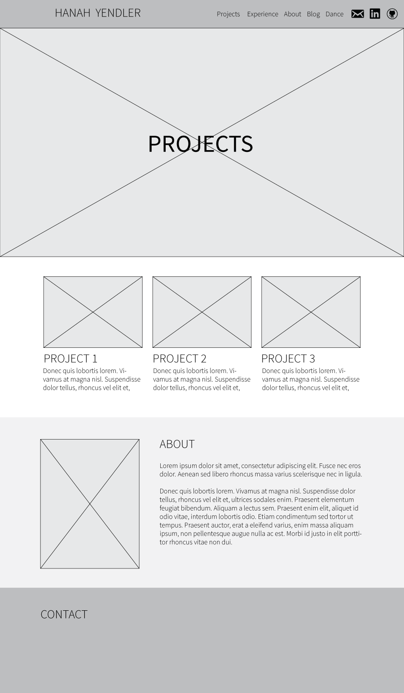
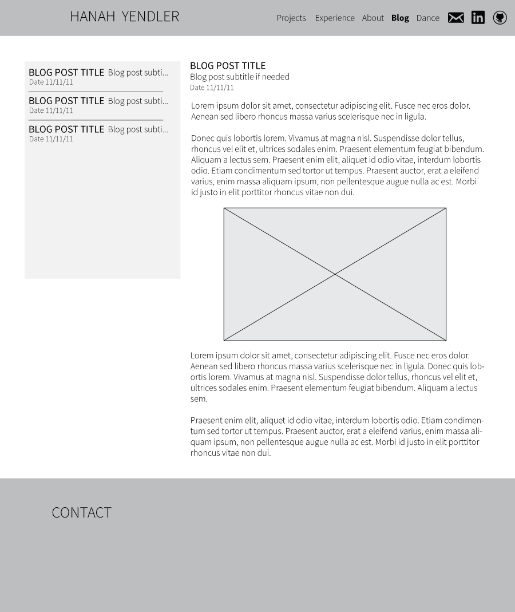

**What is a wireframe?**

A wireframe is a very simple mock up of the website, that determines the layout and sometimes functionality, but not design (so no colors, actual pictures, etc)

**What are the benefits of wireframing?**

A wireframe is a really easy, low cost (both in time and money) way to plan out your website

**Did you enjoy wireframing your site?**

Yep!

**Did you revise your wireframe or stick with your first idea?**

I only revised the blog one because I didn't read the challenge prompt properly.  I might end up revising it later, just because the design right now just looks like your typical bootstrap website.  I might try to do something a little more a-typical/artsy.

**What questions did you ask during this challenge? What resources did you find to help you answer them?**

I've done wireframing before, so I don't have too many questions.  I did ask myself if I wanted to try a different wireframing, but I really just like the blank canvas approach of Ai.  So I ended up using that.

**Which parts of the challenge did you enjoy and which parts did you find tedious?**

I enjoy thinking about layout and functionality in a wesbite.  I sometimes find it frustrating to really think about the proper placement of minor details (such as should the date of the blog go to the side or under the title?).  Design is fun, until a point. 