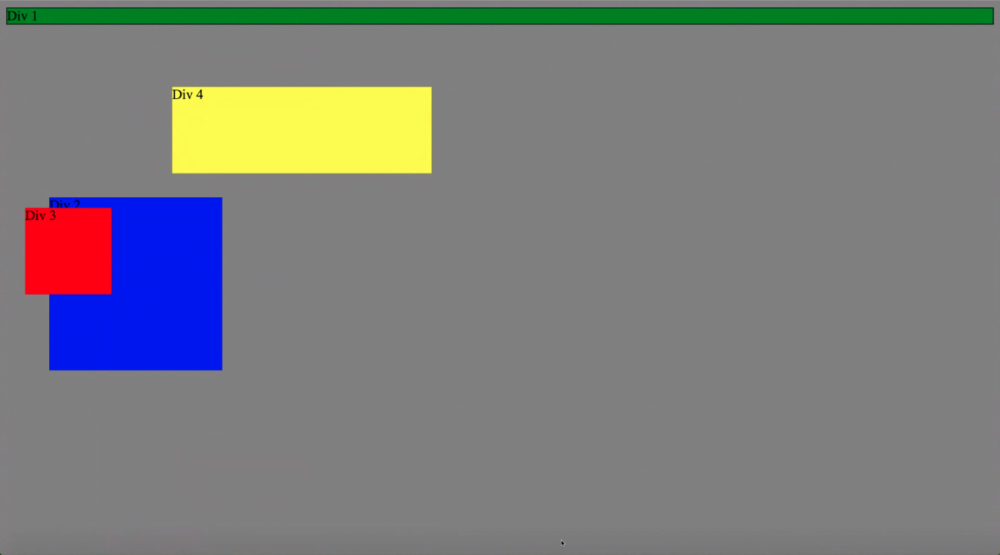
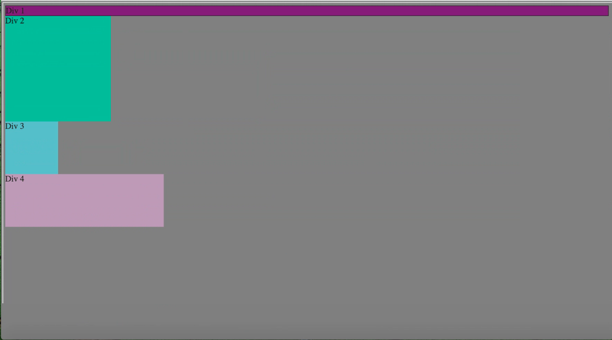
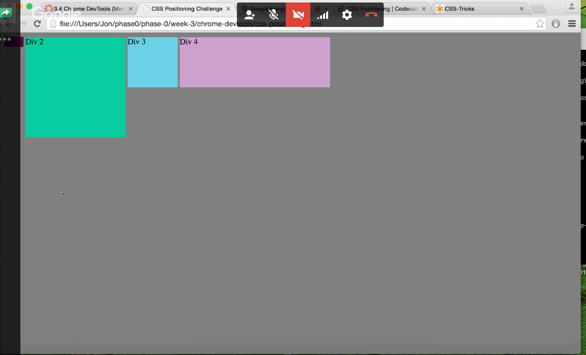
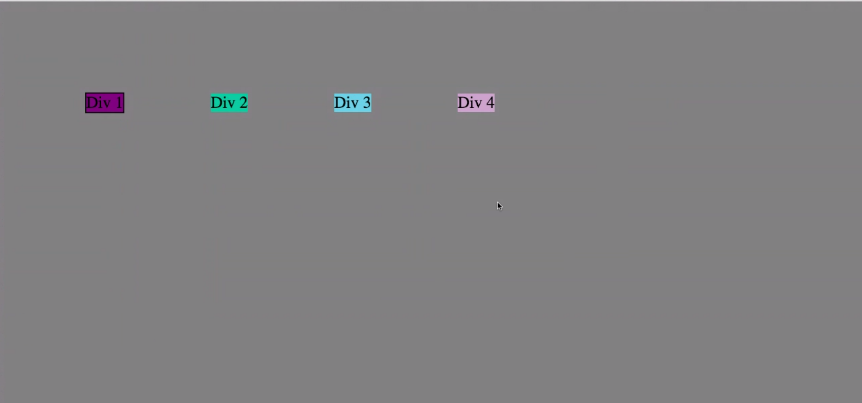
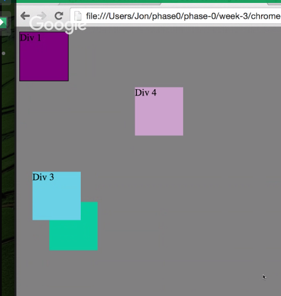
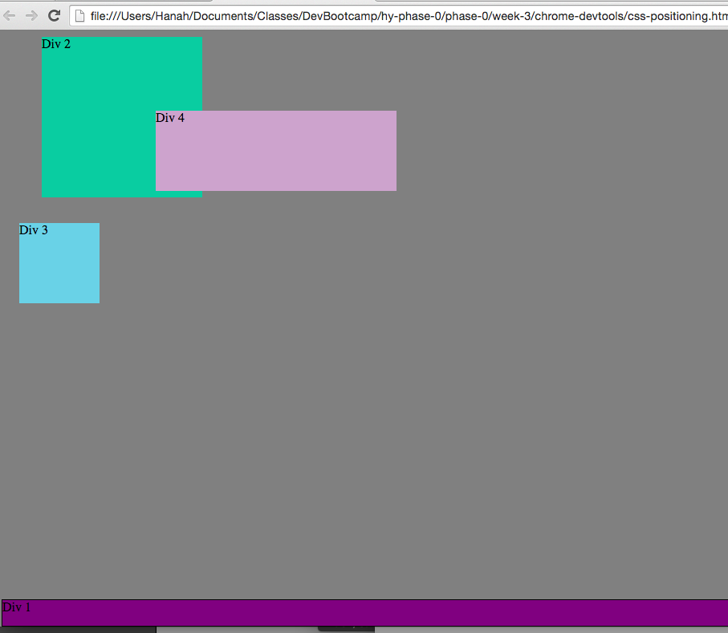
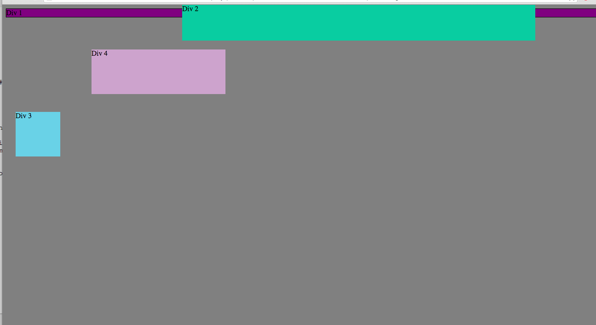
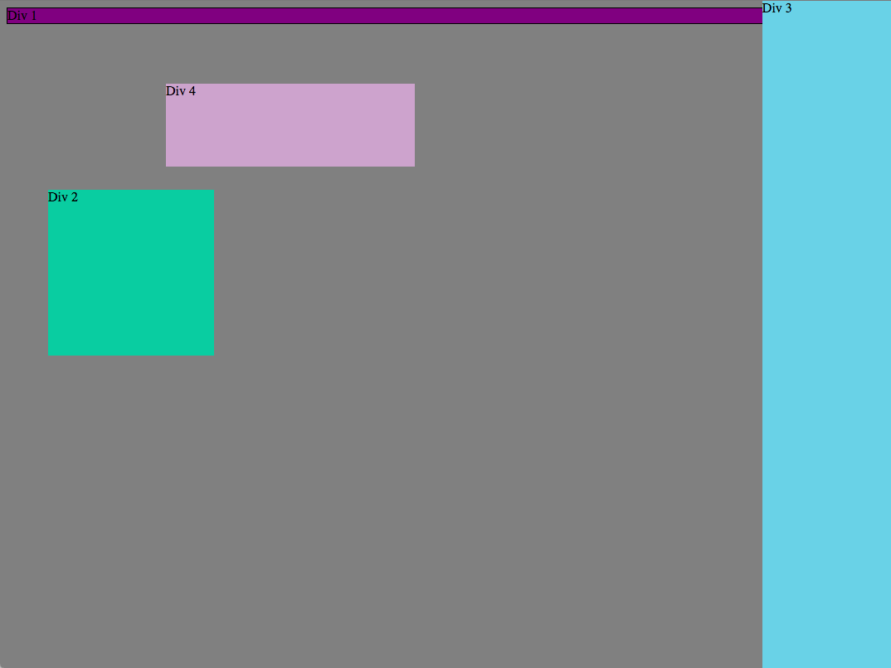
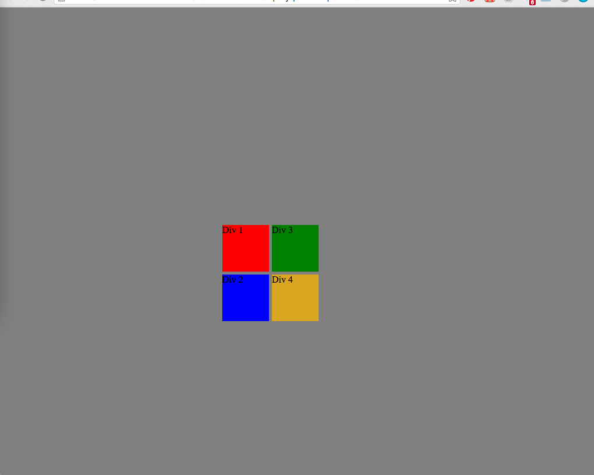

**How can you use Chrome's DevTools inspector to help you format or position elements?**

Chrome's DevTools are great because they can help you see CSS changes instantaneously.  It's a great livefeedback system.  Also, I find that the margin/border/padding box on the bottom and the visual overlays it provides extremely helpful for understanding how to position and size things correctly.

**How can you resize elements on the DOM using CSS?**

CSS has height and width properties.  You can use different length properties - either pixels, ems (which are relative to the page), and percentages (which are also relative to the page)

**What are the differences between absolute, fixed, static, and relative positioning? Which did you find easiest to use?**

Position fixed is when the object is positioned in a fixed spot in the browser, irregardless of scrolling or other elements on the page.  

Static position is the default positioning, where the element has no positioning applied to it.  And because of the automatic browser applied display block, elements will look like they are just stacked ontop of each other.

Absolute positioning means that the element is removed from the order/flow of the document and placed where you want it to go.

Relative positioning means that you can move an element relative to it's original position.

**Which was most difficult?**

The most difficult one is actually combining them all to work together.  (Like doing absolute positioning inside of relative positioning.)

**What are the differences between margin, border, and padding?**

Margin is the space added to the outside of a div, border is the outline of the div (and is also added to the outside of the div, hence making the whole div larger), and padding is added to the inside of the div, also making the div look larger.

**What was your impression of this challenge overall? (love, hate, and why?)**

Positioning in CSS is just tough overall.  I like making things pretty, but why does it have to be so hard?  It's also difficult to tell why one style is being applied, or how different styles interact with eachother (especially when it comes to positioning). 