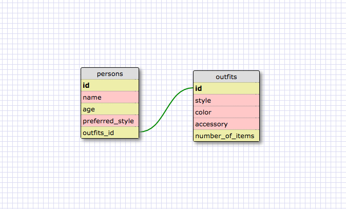

1. SELECT * FROM states;
2. SELECT * FROM regions;
3. SELECT state_name, population FROM states;
4. SELECT state_name, population FROM states ORDER BY population DESC;
5. SELECT state_name FROM states WHERE region_id = 7;
6. SELECT state_name, population_density FROM states WHERE population_density > 50 ORDER BY population_density ASC;
7. SELECT state_name FROM states WHERE population BETWEEN 1000000 and 1500000;
8. SELECT state_name, region_id FROM states ORDER BY region_id ASC;
9. SELECT region_name FROM regions WHERE region_name LIKE '%Central%';
10. SELECT regions.region_name, states.state_name FROM regions INNER JOIN states ON regions.id = states.region_id;

# What are databases for?
Databases are for storing information/data, and can do so in a relational way.

# What is a one-to-many relationship?
A one-to-many relationship is kinda like a tree - there are one level of objects that each have a relationship with another whole set of objects, but not the other way around.

# What is a primary key? What is a foreign key? How can you determine which is which?
A primary key is the primary determinent of that row in the table.  It has to be unique (duplicates would cause issues), and serves as an identifier for that particular row entry.  A foreign key is the connector to a primary key from another database.  

# How can you select information out of a SQL database? What are some general guidelines for that?
There is a great clause of SELECT ... FROM which allows you to select particular data from tables.  The great thing is that you can have many addendums to SELECT FROM in order to be more selective in what you are looking for.