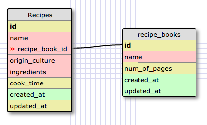
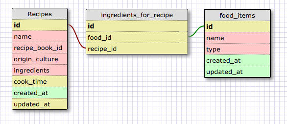

# What is a one-to-one database?
One-to-one database represents a one way singular connection between a set of two items.

# When would you use a one-to-one database? (Think generally, not in terms of the example you created).
One-to-one database represents a singular relationship that may exist - sometimes it does, sometimes it does not which is why it's good to have it as a separate table, as opposed to included in the original one.

# What is a many-to-many database?
Many-to-many database has multiple tables, all connected, to demonstrate complex relationships.

# When would you use a many-to-many database? (Think generally, not in terms of the example you created).
You would use a many-to-many database when you needed to show a relationship between a set of many things and another set of many things.  

# What is confusing about database schemas? What makes sense?
Makes sense from a logic standpoint!